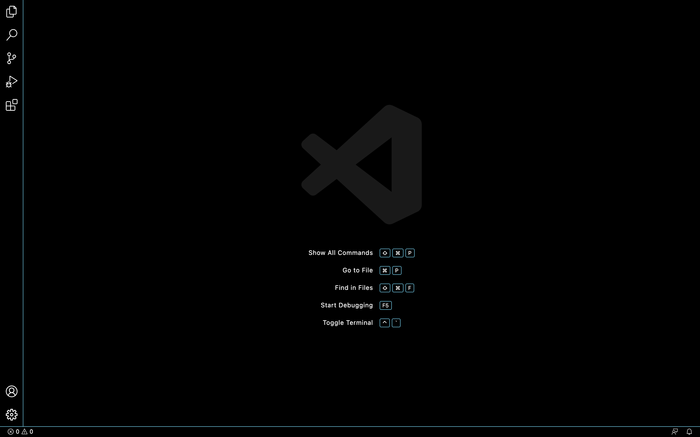
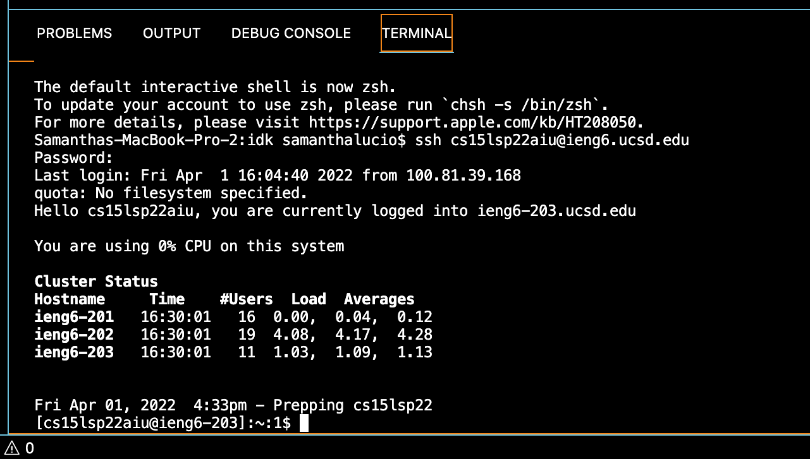
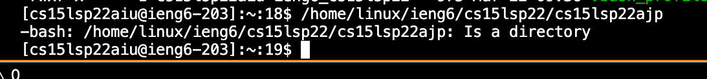
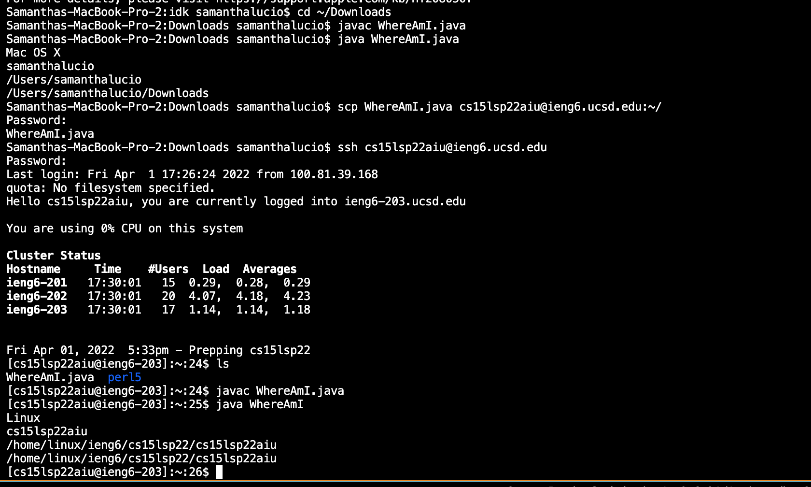
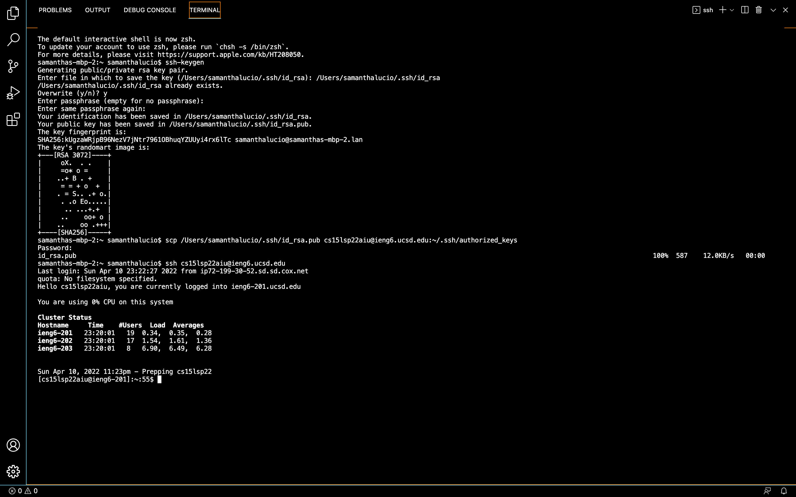

# Week 2 Lab Report

## How to Log Into a Course-Specific Account on ieng6.

## 1. Install VSCode

- Download VSCode with this website link below: 
- [InstallVSCode](https://code.visualstudio.com/). 
   
- Once you install VSCode, you will open the application and see this:



## 2. Remotely Connecting

- First, open the VSCode terminal and put: ``` $ ssh cs15lsp22zz@ieng6.ucsd.edu ```
- If a question pops up, make sure to type 'y' for yes and input your password. 
- You should see something like this:



## 3. Trying Some Commands

- There are many types of commands you can use like cd, ls, and cp. "ls" shows you what it is in your directory. 
- In my example, I used ``` /home/linux/ieng6/cs15lsp22/cs15lsp22abc ``` 
    - [abc] was my classmates username and it tells you whether it is a directory or not. 
    


## 4. Moving Files over SSH with scp

- If you have a file on your computer and want to transfer it to a remote computer, you will use the command `scp`. 
- For example, once you have compiled the file on the client server, you will type in your terminal: 
    ``` scp <your file> cs15lsp22zz@ieng6.ucsd.edu:~/ ```
- After, you log in remotely (using ssh). When you use ls, you will see that file on the remote server. 



## 5. Setting an SSH Key

- On your client, type: ``` $ ssh-keygen ```. Then you enter your file name where you want to save it.
- After, type: ``` $ scp /Users/<user-name>/.ssh/id_rsa.pub cs15lsp22zz@ieng6.ucsd.edu:~/.ssh/authorized_keys ```
- Now, when you use ssh, it does not ask for your password.
- The picture provided below is more detailed:

   

## 6. Optimizing Remote Running
- You can use commands in quotes to make it faster when running ssh.